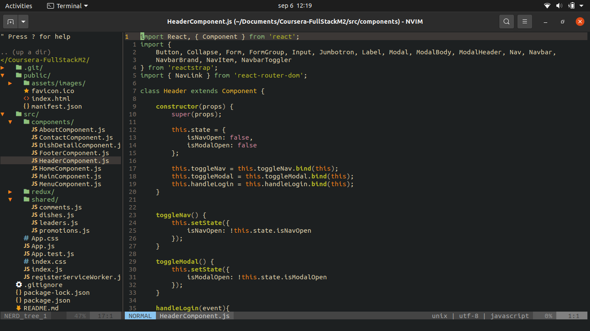
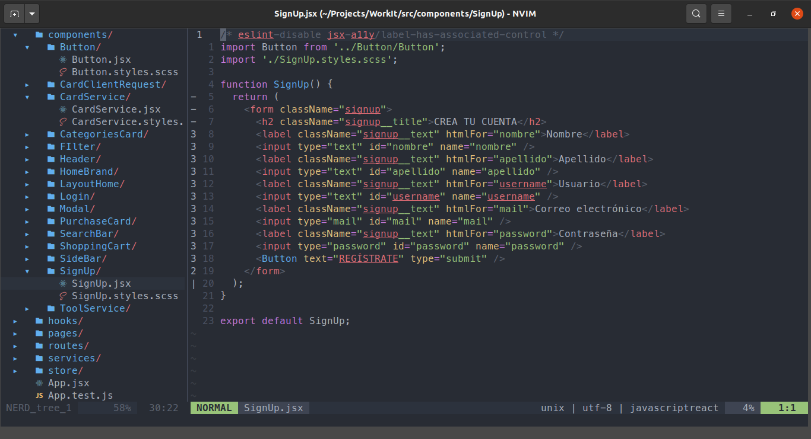

# NVIM basic configuration




## Requirements

- Git
- Nodejs
- Npm

## Installation guide

Install Neovim

```sh
sudo apt install neovim
```

Clone this repository

```sh
git clone https://github.com/Danatts/nvim.git ~/.config/nvim --depth 1
```

Install [vim-plug](https://github.com/junegunn/vim-plug)

```sh
curl -fLo ~/.config/nvim/autoload/plug.vim --create-dirs https://raw.githubusercontent.com/junegunn/vim-plug/master/plug.vim
```

Run `nvim` on the terminal to initialize Neovim and press `enter` until vim has started.

Type `PlugInstall` on command mode in order to install the plugins.

Close Neovim and open again to see the changes.

## Plugins used

- Auto completion: [neoclide/coc.nvim](https://github.com/neoclide/coc.nvim)
- Auto pairs: [jiangmiao/auto-pairs](https://github.com/jiangmiao/auto-pairs)
- Better comments: [jbgutierrez/vim-better-comments](https://github.com/jbgutierrez/vim-better-comments)
- Close HTML tags: [alvan/vim-closetag](https://github.com/alvan/vim-closetag)
- Editor config: [editorconfig/editorconfig-vim](https://github.com/editorconfig/editorconfig-vim)
- Emmet: [mattn/emmet-vim](https://github.com/mattn/emmet-vim)
- File explorer: [preservim/nerdtree](https://github.com/preservim/nerdtree)
- File filter: [junegunn/fzf.vim](https://github.com/junegunn/fzf.vim)
- Files highlights: [tiagofumo/vim-nerdtree-syntax-highlight](https://github.com/tiagofumo/vim-nerdtree-syntax-highlight)
- Files icons: [ryanoasis/vim-devicons](https://github.com/ryanoasis/vim-devicons)
- Git branch on status bar: [itchyny/vim-gitbranch](https://github.com/itchyny/vim-gitbranch)
- Git status: [Xuyuanp/nerdtree-git-plugin](https://github.com/Xuyuanp/nerdtree-git-plugin)
- Handle surrounding: [tpope/vim-surround](https://github.com/tpope/vim-surround)
- Live web server: [turbio/bracey.vim](https://github.com/turbio/bracey.vim)
- Light status bar: [itchyny/lightline.vim](https://github.com/itchyny/lightline.vim)
- Polyglot package: [vim-polyglot](https://github.com/sheerun/vim-polyglot)

## Themes

- Gruvbox theme: [morhetz/gruvbox](https://github.com/morhetz/gruvbox)
- Onedark theme: [joshdick/onedark.vim](https://github.com/joshdick/onedark.vim)

## To take into account

Check the [Language Server List](https://github.com/neoclide/coc.nvim/wiki/Language-servers)
to download CoC extensions.

An example:

```sh
:CocInstall coc-json coc-tsserver
```
